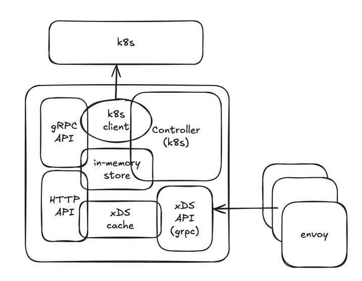

# Architecture: Envoy XDS Controller

## Architecture Overview

This document describes the internal architecture of the Envoy XDS Controller. For a general project overview, see the [Overview](overview.md) document.

The Envoy XDS Controller architecture follows a Kubernetes controller pattern with an embedded xDS server. It consists of several key components that work together to transform Kubernetes Custom Resources into Envoy proxy configurations.

## High-Level Architecture Diagram

## Logical Architecture Components

### 1. Kubernetes Controller Manager
The main component that manages the lifecycle of Custom Resources and ensures their processing. It includes:
- **Resource Controllers** - process CR changes and update the xDS cache
- **Webhooks** - validate CRs before their creation/update
- **Health/Readiness checks** - provide monitoring of the controller's state

### 2. API Definitions (CRDs)
Custom resource definitions that represent Envoy configuration:
- **Cluster** - defines upstream clusters for Envoy
- **Listener** - defines listeners (ports and protocols)
- **Route** - defines routing rules
- **VirtualService** - combines Listener, Route, and Cluster to create a complete service configuration
- **VirtualServiceTemplate** - templates for VirtualService
- **AccessLogConfig** - access logging configuration
- **HttpFilter** - HTTP filters for Envoy
- **Policy** - security and access policies

### 3. xDS Server
Server implementing the xDS API for Envoy:
- **SnapshotCache** - stores the current configuration for each Envoy proxy
- **CacheUpdater** - updates the cache when CRs change
- **ResourceBuilder** - transforms CRs into xDS resources

### 4. Store
In-memory resource storage:
- Stores all CRs loaded from Kubernetes
- Provides fast access to resources for building configuration

### 5. API Servers (optional)
API servers for debugging and management:
- **HTTP API** - REST API for viewing and managing configuration
- **gRPC API** - gRPC API for programmatic configuration management

### 6. FileWatcher
Component for tracking changes in configuration files:
- Monitors file changes and updates configuration

## Component Interactions

1. **CR Change Processing Flow**:
   - Kubernetes API Server notifies the controller about CR changes
   - The corresponding controller (e.g., VirtualServiceReconciler) processes the change
   - The controller calls CacheUpdater to update the configuration
   - CacheUpdater uses ResourceBuilder to transform CRs into xDS resources
   - CacheUpdater updates the SnapshotCache
   - Envoy proxies receive the updated configuration via the xDS API

2. **Interaction with Envoy**:
   - Envoy proxies connect to the xDS server
   - The xDS server provides configuration from the SnapshotCache
   - When the configuration changes, the xDS server notifies Envoy

3. **Resource Validation**:
   - Webhooks validate CRs before their creation/update
   - CacheUpdater checks the correctness of the configuration when updating the cache

## Technical Features

1. **Use of controller-runtime**:
   - The project is built on the Kubernetes controller-runtime
   - Uses standard patterns for developing Kubernetes operators

2. **Extensibility**:
   - Modular architecture allows adding new resource types
   - Support for templates for configuration reuse

3. **Security**:
   - TLS support for xDS API
   - Integration with Kubernetes RBAC
   - Resource validation through webhooks

4. **Debugging and Monitoring**:
   - API for viewing current configuration
   - Prometheus metrics
   - Health/Readiness checks
